WILD 562: Intro to Step Selection Functions
================
Mark Hebblewhite and Eric Palm
February 14, 2023

# Introduction to Step Selection Functions

In today’s lab we will explore the matched-case control sampling design
for use-availability study designs with animal tracking data. First
pioneered by Compton et al. (2002) for the wood box tortoise, and later
by Whittington et al. (2005) for wolves, the conditional logistic
regression design has assumed a dominant role in the analysis of animal
resource selection with GPS-type movement data (Fortin et al. 2005,
Forester et al. 2009). These have become called step-selection functions
(SSF) in animal movement and spatial ecology.

Conditional logistic regression models are also known by many synonyms;
matched-case control logistic regression, case-control, paired, and
conditional logistic regression. All formulations estimate the same
statistical model. Moreover, this model can be estimated either using
its own direct likelihood formula (e.g., in packages like SAS or STATA)
or, via the Cox proportional hazards model in R. The proof that both
likelihoods are equivalent is not difficult if you are a statistics PhD,
but unimportant to ecologists.

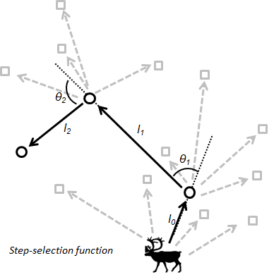

Sampled locations (black circles in Figure 1 above) are paired with
biologically realistic samples of ‘availability’ (n=4 in this case)
given where the animal could have gone at time t=3 in this example.
Random paired available points can be generated from the observed step
length from t=3 to t=4, or the empirical step length and turning angle
distribution for the vector of animal relocations along the entire path
t = 1 to 4, in this case. This kind of sampling design overcomes many of
the common problems of defining availability, and helps ensure that
availability is defined from the animals perspective.

# Loading necessary packages

The `amt` package (animal movement tools) is a new package that is very
handy for a lot of resource selection analyses. [Here’s a
link](https://www.researchgate.net/publication/331112461_Animal_movement_tools_amt_R_package_for_managing_tracking_data_and_conducting_habitat_selection_analyses)
to a recently published paper about `amt`.

``` r
#function to install and load required packages
ipak <- function(pkg){
  new.pkg <- pkg[!(pkg %in% installed.packages()[, "Package"])]
  if (length(new.pkg)) 
    install.packages(new.pkg, dependencies = TRUE)
  sapply(pkg, require, character.only = TRUE)
}

packages <- c("terra","sf","amt","mapview","tmap","tidyverse","survival","sjPlot","lme4")

#run function to install packages
ipak(packages)
```

# Biased-Correlated Random Walks

*From Fagan and Calabrese - Bulletin of the Ecological Society of
America 2014*

The origins of Step Selection Functions stem from the earliest days of
animal ecology with Skellam’s classic 1950’s paper. But the field of
movement ecology didnt really get started until field ecologists started
working with theoretical physicists and ecologists to understand how to
conceptualize movement based on ideal gas law theories. These seminal
studies were summarized by Peter Turchin in his landmark book,
Quantitative Analysis of Animal Movement (Turchin 1999).

More than 30 years ago, an early, sturdy bridge between field data and
spatial ecological theory was built when the article “Analyzing insect
movement as a correlated random walk” was published in Oecologia. This
paper, which represented a collaboration between ecologist Peter Kareiva
and mathematician Nanako Shigesada, is a milestone along the Paper Trail
because it marks a critical link between the abstract world of
ecological theory and the hands-on way in which ecologists actually
collect data on individual animals.

This correlated random walk model was comprised of steps and turns, and
Kareiva and Shigesada showed how one could estimate these distributions,
and, make them functions of spatial or temporal covariates through field
data. The biased correlated random walk emerged, and represents the
cornerstone of the step dplyr::selection function concept. And it links
the mechanistic movement models of Moorcroft, Lewis and Barnett to field
data approaches commonly collected with GPS data.

In this first excercise, we will explore how different ‘parameters’ of
movement (step, turns) and bias towards a centroid influence the spatial
pattern of movement. In essence, the BCRW is the driver of the movement
kernel distribution in the iSSF models we will use from the package amt.

First, we make a function that draws random movements based on 3
parameters, a, b, rho (the degree of correaltion), and an attraction to
a home range activity center. a and b are parameters of the step lenght
distribution, fit as a Weibull distribution. Larger values of a or b
represent more or less longer step lenghts. Rho is the degree of
directional persistence or ‘bias’ in the correlation in direction
between steps, and the attraction is equivalent to the mathematical
advection term in Moorcroft and Barnett.

Here, we will compare just 3 types of fits to explore, but I encourage
you to play around with the paramters on your own to get a feel for
unbiased and biased correlated random walks.

``` r
#### Correlated Random Walks
BCRW <- function(a = 2, b = 1, rho = 0.7, Z.center = 0, attraction = 0.5, n = 50, Z0 = 0){
  require(CircStats)
  
  Z <- c(Z0, rep(NA,n-1))
  phi <- runif(1, -pi, pi)
  for(i in 2:n)
  {
    # relative orientation to center of attraction
    chi <- Arg(Z.center - Z[i-1])
    dphi <- chi-phi
    if(abs(chi - phi) > pi) dphi <- (chi - phi) - pi
    
    # adjust the location 
    location <- phi + attraction * dphi
    
    # pick a new absolute direction ... but MUST BE BETWEEN -pi and pi
    phi <- rwrpcauchy(1, location, rho) - 2*pi
    if(phi > pi) phi <- phi-2*pi
    if(phi < -pi) phi <- phi+2*pi
    
    Z[i] <- Z[i-1] + complex(arg = phi, mod = rweibull(1, a, b))
  }
  return(Z)
}

BCRW(a = 2, b = 1, rho = 0, Z.center = 10, attraction = 0.25, n = 2000) %>% 
  plot(type="o", asp=1, pch = 21, bg= grey(seq(0,1,length = 2000)),
       main = "a = 2, b = 1, rho = 0.2, attraction = 0")
```

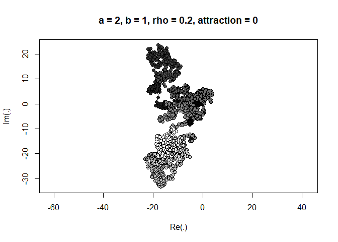<!-- -->

``` r
BCRW(a = 2, b = 1, rho = 0.5, Z.center = 10, attraction = 0.25, n = 2000) %>% 
  plot(type="o", asp=1, pch = 21, bg= grey(seq(0,1,length = 200)),
       main = "a = 2, b = 1, rho = 0.7, attraction = 0.5")
```

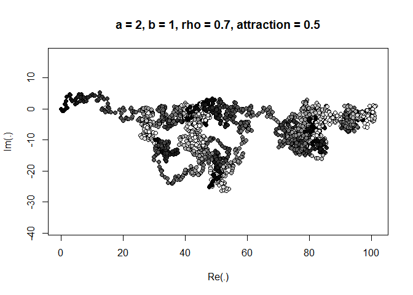<!-- -->

``` r
BCRW(a = 2, b = 1, rho = 0.7, Z.center = 10, attraction = 0.25, n = 2000) %>% 
  plot(type="o", asp=1, pch = 21, bg= grey(seq(0,1,length = 200 )),
       main = "a = 2, b = 1, rho = 0.7, attraction = 0.8")
```

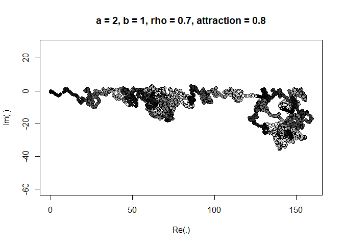<!-- -->

These three little simulations demonstrate the effects of varying
correlation, or bias, in the step lengths for the same step length
distribution (here, fit by an a and b), and the same measure of home
range attraction. It is this biased CRW that forms the basis of the
breaking apart of the movement process into its constituent elements and
provides the foundation for understanding links between empirical
analysis of animal movement and theory. Indeed, next week, in Lab 10, it
is exactly this kind of simulation in the SSF that generates the spatial
predictions of the expected utilization distribution, based on the
‘bias’ terms made explicity from the habitat selection and movement
process.

But this week, we will get started with understanding the SSF components
and process, ending with fitting models with conditional logistic
regression models.

# Loading and importing data

First let’s load a set of basic habitat covariates, focusing on just
topographic covariates and human access data from Banff National Park.
We will focus just on continuous variables this week, and work on
categories next week in SSF Lab 2. We will bring them all in, then
create a raster stack.

``` r
elev<-rast("Data/elev.tif")
slope<-rast("Data/slope.tif")
d_human<-rast("Data/d_human.tif")
d_high_human <-rast("Data/d_high_human.tif")

habitat_stack<-c(elev, slope, d_human, d_high_human)
plot(habitat_stack)
```

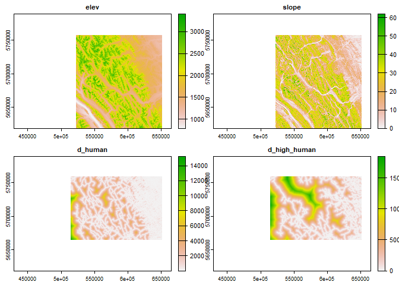<!-- -->

``` r
#habitat_stack@layers
```

And then our elk telemetry data:

``` r
elk_df <- read_csv("./data/elk_df.csv")
```

For some reason the `read_csv` function didn’t parse the timestamp
column as “datetime” format, so we’ll manually convert it to POSIXct
format, which is the date-time format that `amt` likes:

``` r
elk_df$timestamp <- as.POSIXct(elk_df$timestamp, format = "%m/%d/%y %H:%M")
elk_df
```

    ## # A tibble: 10,227 × 5
    ##    id      lat   lon elevation timestamp          
    ##    <chr> <dbl> <dbl>     <dbl> <dttm>             
    ##  1 yl2    51.7 -116.      1577 2003-04-15 22:00:00
    ##  2 yl2    51.7 -116.      1657 2003-04-15 20:00:00
    ##  3 yl2    51.7 -116.      1657 2003-04-15 12:00:00
    ##  4 yl2    51.7 -116.      1669 2003-04-15 10:00:00
    ##  5 yl2    51.7 -116.      1669 2003-04-15 08:00:00
    ##  6 yl2    51.7 -116.      1669 2003-04-15 06:00:00
    ##  7 yl2    51.7 -116.      1681 2003-04-15 04:00:00
    ##  8 yl2    51.7 -116.      1681 2003-04-15 02:00:00
    ##  9 yl2    51.7 -116.      1679 2003-04-15 00:00:00
    ## 10 yl2    51.7 -116.      1657 2003-04-15 18:00:00
    ## # … with 10,217 more rows

Now the “timestamp” column is formatted as a “datetime”.

# Data visualization and exploration

It’s good to look at your data on a map and make sure nothing looks
ridiculous. First, let’s convert the data frame to an `sf` object so we
can plot it a few different ways.

``` r
elk_sf <- st_as_sf(elk_df,
                   coords = c("lon","lat"), 
                   crs = "EPSG:4326")
elk_sf_UTM <- st_transform(elk_sf, crs = "+proj=utm +zone=11 +ellps=GRS80 +units=m +no_defs")
```

If we want to take a quick look at our elk data on an interactive map,
we can plot it using `mapview` with a basemap of our choosing (there are
a lot more basemap options and other ways to make this prettier.)

``` r
mapview(elk_sf, zcol="id", legend = TRUE, cex=5, lwd=2, map.type = "Esri.DeLorme")
```

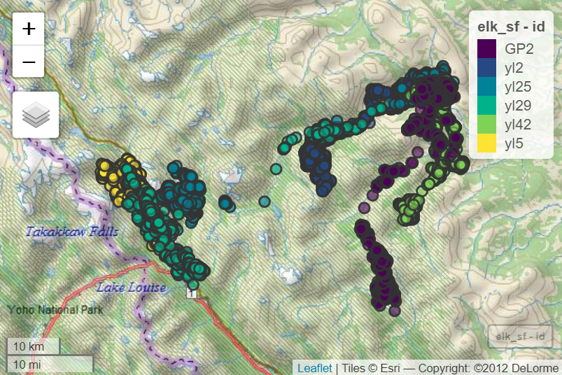

We can overlay our elk telemetry locations on the elevation raster:

``` r
tmap_mode("plot")
map <- tm_shape(habitat_stack$elev) + tm_raster()
map + tm_shape(elk_sf_UTM) + tm_dots(col = "id", palette = "Dark2", n = 6)
```

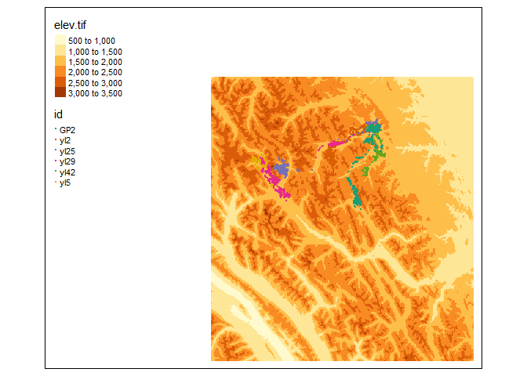<!-- -->

``` r
#plot(habitat_stack$elev)
#points(elk_sf_UTM, pch=20, col=c("blue", "red", "green", "purple", "navy", "darkgreen")[as.factor(elk_sf_UTM$id)])
```

To get an idea of how many locations we have per individual:

``` r
table(elk_df$id)
```

    ## 
    ##  GP2  yl2 yl25 yl29 yl42  yl5 
    ## 2058 1999 1558 1494 1970 1148

Note, here, I have created a subset of just 6 elk from our beloved elk
GPS data.

# Creating and nesting an `amt` track

We’ll use the make_track function to do this. Our data is in WGS 84, so
we’ll specify that as the coordinate reference system
(“+init=epsg:4326”), and then transform it to UTM because `amt` requires
projected data rather than lon lat.

``` r
elk_trk <- amt::make_track(elk_df, .x=lon, .y=lat, .t=timestamp, id=id, crs = "EPSG:4326") %>%
      amt::transform_coords("+proj=utm +zone=11 +ellps=GRS80 +units=m +no_defs")
elk_trk
```

    ## # A tibble: 10,227 × 4
    ##         x_       y_ t_                  id   
    ##  *   <dbl>    <dbl> <dttm>              <chr>
    ##  1 603229. 5732236. 2003-04-15 00:00:00 yl2  
    ##  2 603072. 5732284. 2003-04-15 00:00:00 yl5  
    ##  3 602840. 5732378. 2003-04-15 00:00:00 yl25 
    ##  4 603465. 5732202. 2003-04-15 00:00:00 yl42 
    ##  5 603350. 5732142. 2003-04-15 00:00:00 GP2  
    ##  6 603285. 5732230. 2003-04-15 00:01:00 yl29 
    ##  7 603155. 5732326. 2003-04-15 02:00:00 yl2  
    ##  8 603217. 5732246. 2003-04-15 02:00:00 yl5  
    ##  9 602874. 5732478. 2003-04-15 02:00:00 yl25 
    ## 10 603291. 5732247. 2003-04-15 02:00:00 yl29 
    ## # … with 10,217 more rows

Notice here that `amt` only requires fields for **x**, **y** and
**time**, but all other fields, including animal **id** are optional. I
think this is to allow flexibility on how you want to analyze the data.

Obviously, because we are going to do SSF analyses, which are based on
individual animal movement paths, we need to make sure we keep track of
animal id. We can do this by nesting our data frame.

Nesting our data frame creates list-columns, which may be difficult to
get used to at first but are quite handy. Here’s we’ll nest by animal
id. However, if we had already broken our data into seasons and wanted
to model resource selection by season, we could nest by both animal id
and season, like this: `nest(-id, -season)`

``` r
elk_trk_nested <-
  elk_trk %>% 
  nest(-id)
```

    ## Warning: All elements of `...` must be named.
    ## Did you want `data = -id`?

This shows the first element in the “data” list-column, which is the
location data for the first individual.

``` r
head(elk_trk_nested$data[[1]])
```

    ## # A tibble: 6 × 3
    ##        x_       y_ t_                 
    ## *   <dbl>    <dbl> <dttm>             
    ## 1 603229. 5732236. 2003-04-15 00:00:00
    ## 2 603155. 5732326. 2003-04-15 02:00:00
    ## 3 602917. 5732472. 2003-04-15 04:00:00
    ## 4 602729. 5732580. 2003-04-15 06:00:00
    ## 5 602489. 5732709. 2003-04-15 08:00:00
    ## 6 602473. 5732727. 2003-04-15 10:00:00

Check for duplicated time stamps and complete cases. for some functions
of amt you need to ensure complete cases, and that there are no EXACTLY
duplicated time stamps within a track, i.e., duplicated GPS locations.
These will yield errors.

``` r
all(complete.cases(elk_trk))
```

    ## [1] TRUE

``` r
any(duplicated(elk_trk$ts))
```

    ## Warning: Unknown or uninitialised column: `ts`.

    ## [1] FALSE

amt also has some additional functionality to calculate time of day,
based on sun angle at that XY location and date based on the R package
maptools. The helpfile for amt says time_of_day is a convenience wrapper
around maptools::sunriset and maptools::crepuscule to extract if a fix
was taken during day or night (optionally also include dawn and dusk).

``` r
elk_trk <- time_of_day(elk_trk)
```

    ## Warning: PROJ support is provided by the sf and terra packages among others

``` r
head(elk_trk)
```

    ## # A tibble: 6 × 5
    ##        x_       y_ t_                  id    tod_ 
    ## *   <dbl>    <dbl> <dttm>              <chr> <fct>
    ## 1 603229. 5732236. 2003-04-15 00:00:00 yl2   night
    ## 2 603072. 5732284. 2003-04-15 00:00:00 yl5   night
    ## 3 602840. 5732378. 2003-04-15 00:00:00 yl25  night
    ## 4 603465. 5732202. 2003-04-15 00:00:00 yl42  night
    ## 5 603350. 5732142. 2003-04-15 00:00:00 GP2   night
    ## 6 603285. 5732230. 2003-04-15 00:01:00 yl29  night

``` r
table(elk_trk$tod_, elk_trk$id)
```

    ##        
    ##          GP2  yl2 yl25 yl29 yl42  yl5
    ##   day   1243 1217  908  860 1165  713
    ##   night  815  782  650  634  805  435

So, a nice mix of day and night locations between individuals. Trick
Question: why are there more day locations?

## `amt` Data Summaries and Visualization

Before we create random “available” steps for each individual to use in
an SSF analysis, we need to decide at what spatiotemporal scale we’re
going to do our analysis. To help us make this decision, we need to know
our sampling rate, or the amount of time between successive locations.
In many studies, GPS collars or tags will be set to different duty
cycles. Some animals may have locations every 2 hours, while others
every 13 hours, etc. These discrepancies can be challenging for
modelling, because we’d like to model using a consistent spatiotemporal
scale across individuals.

Let’s see what our elk data look like. `amt`’s `summarize_sampling_rate`
function gives us more information than we would ever want to know about
the sampling interval, or time lag, between consecutive GPS locations.
We’ll add a new column called “lags”.

``` r
  elk_trk %>% 
  nest(-id) %>% 
  mutate(lags = map(data, summarize_sampling_rate))
```

    ## Warning: All elements of `...` must be named.
    ## Did you want `data = -id`?

    ## # A tibble: 6 × 3
    ##   id    data                   lags            
    ##   <chr> <list>                 <list>          
    ## 1 yl2   <trck_xyt [1,999 × 4]> <tibble [1 × 9]>
    ## 2 yl5   <trck_xyt [1,148 × 4]> <tibble [1 × 9]>
    ## 3 yl25  <trck_xyt [1,558 × 4]> <tibble [1 × 9]>
    ## 4 yl42  <trck_xyt [1,970 × 4]> <tibble [1 × 9]>
    ## 5 GP2   <trck_xyt [2,058 × 4]> <tibble [1 × 9]>
    ## 6 yl29  <trck_xyt [1,494 × 4]> <tibble [1 × 9]>

``` r
## lets take a look at some of the summary statistics
elk_trk2 <-elk_trk_nested %>% 
  mutate(lags = map(data, summarize_sampling_rate))
elk_trk2$lags
```

    ## [[1]]
    ## # A tibble: 1 × 9
    ##     min    q1 median  mean    q3   max    sd     n unit 
    ##   <dbl> <dbl>  <dbl> <dbl> <dbl> <dbl> <dbl> <int> <chr>
    ## 1  1.78     2      2  2.20     2  12.0 0.993  1998 hour 
    ## 
    ## [[2]]
    ## # A tibble: 1 × 9
    ##     min    q1 median  mean    q3   max    sd     n unit 
    ##   <dbl> <dbl>  <dbl> <dbl> <dbl> <dbl> <dbl> <int> <chr>
    ## 1 0.517     2      2  3.14  2.02  384.  11.9  1147 hour 
    ## 
    ## [[3]]
    ## # A tibble: 1 × 9
    ##     min    q1 median  mean    q3   max    sd     n unit 
    ##   <dbl> <dbl>  <dbl> <dbl> <dbl> <dbl> <dbl> <int> <chr>
    ## 1  0.25     2      2  2.82  2.02    28  2.46  1557 hour 
    ## 
    ## [[4]]
    ## # A tibble: 1 × 9
    ##     min    q1 median  mean    q3   max    sd     n unit 
    ##   <dbl> <dbl>  <dbl> <dbl> <dbl> <dbl> <dbl> <int> <chr>
    ## 1  1.78     2      2  2.23     2    14  1.03  1969 hour 
    ## 
    ## [[5]]
    ## # A tibble: 1 × 9
    ##     min    q1 median  mean    q3   max    sd     n unit 
    ##   <dbl> <dbl>  <dbl> <dbl> <dbl> <dbl> <dbl> <int> <chr>
    ## 1  1.78     2      2  2.13     2    12 0.774  2057 hour 
    ## 
    ## [[6]]
    ## # A tibble: 1 × 9
    ##     min    q1 median  mean    q3   max    sd     n unit 
    ##   <dbl> <dbl>  <dbl> <dbl> <dbl> <dbl> <dbl> <int> <chr>
    ## 1  0.25     2      2  2.94  2.02    46  3.32  1493 hour

Here, we see that there are on average a median of 2 hours between
locations across our 6 individual elk. The “median” column is most
useful here.

But we’re just interested in seeing what’s actually in the “lags”
list-column. Because this column is nested, we can now “unnest” it to
see our sampling rate summary. Let’s keep the “id” column too so we can
see our animal ids.

``` r
elk_trk %>% 
  nest(data = -id) %>% 
  mutate(lags = map(data, summarize_sampling_rate)) %>%
    dplyr::select(-data) %>%
  unnest(lags)
```

    ## # A tibble: 6 × 10
    ##   id      min    q1 median  mean    q3   max     sd     n unit 
    ## * <chr> <dbl> <dbl>  <dbl> <dbl> <dbl> <dbl>  <dbl> <int> <chr>
    ## 1 yl2   1.78      2      2  2.20  2     12.0  0.993  1998 hour 
    ## 2 yl5   0.517     2      2  3.14  2.02 384.  11.9    1147 hour 
    ## 3 yl25  0.25      2      2  2.82  2.02  28    2.46   1557 hour 
    ## 4 yl42  1.78      2      2  2.23  2     14    1.03   1969 hour 
    ## 5 GP2   1.78      2      2  2.13  2     12    0.774  2057 hour 
    ## 6 yl29  0.25      2      2  2.94  2.02  46    3.32   1493 hour

Luckily we have pretty consistent time lags of 2 hours across all
individuals. So, the finest scale we can do an analysis would be at the
2-hr scale, which is probably something like between Johnson’s 3rd to
4th order of selection.

Here, we can use some more `amt` functions to calculate some simple
movement statistics from our data. The `amt` package has a cool function
called `time_of_day` which calculates whether a location is during the
day or night based on the angle of the sun at the particular coordinates
and the timestamp.

``` r
elk_trk_stats <- 
  elk_trk %>% 
  nest(data = -id) %>% 
  mutate(speed = map(data, speed),
         step_length = map(data, step_lengths),
         tod_ = map(data, time_of_day), 
         turn_angle = map(data, ~direction_rel(.) %>% as_degree(.))) %>%   dplyr::select(-data) %>% 
  unchop(speed:turn_angle)
```

The warnings here just let us know that we have a lot of different units
in the summary statistics we’ve created. Step lengths are in meters,
speeds in meters/second, and turn angles in degrees bound between -180
and 180. Notice the first turning angle is NA. This is because we need
three consecutive locations to calculate a relative turning angle.

You can see there are NAs in “speed”, “step_length” and “turn_angle”:

``` r
summary(elk_trk_stats)
```

    ##       id                speed           step_length      
    ##  Length:10227       Min.   :0.000075   Min.   :    0.55  
    ##  Class :character   1st Qu.:0.009743   1st Qu.:   73.36  
    ##  Mode  :character   Median :0.023676   Median :  185.59  
    ##                     Mean   :0.048280   Mean   :  426.24  
    ##                     3rd Qu.:0.056282   3rd Qu.:  456.29  
    ##                     Max.   :0.976760   Max.   :34936.17  
    ##                     NA's   :6          NA's   :6         
    ##              tod_.x_                           tod_.y_                           tod_.t_                          tod_.tod_            
    ##  Min.   :541357.9                  Min.   :5693120                   Min.   :2003-04-15 00:00:00.00    day  :6106                      
    ##  1st Qu.:580219.4                  1st Qu.:5713779                   1st Qu.:2003-05-24 06:00:00.00    night:4121                      
    ##  Median :598421.3                  Median :5723898                   Median :2003-07-04 02:00:00.00    NA                              
    ##  Mean   :587760.1                  Mean   :5722101                   Mean   :2003-07-07 22:17:33.91    NA                              
    ##  3rd Qu.:602121.7                  3rd Qu.:5732647                   3rd Qu.:2003-08-19 03:00:30.00    NA                              
    ##  Max.   :607082.3                  Max.   :5737618                   Max.   :2003-10-14 22:00:00.00    NA                              
    ##                                                                                                                                        
    ##    turn_angle      
    ##  Min.   :-179.997  
    ##  1st Qu.: -83.724  
    ##  Median :  -1.746  
    ##  Mean   :  -2.468  
    ##  3rd Qu.:  76.316  
    ##  Max.   : 179.916  
    ##  NA's   :12

Something strange happed with the summary statistics of time of day.

``` r
head(elk_trk_stats)
```

    ## # A tibble: 6 × 5
    ##   id      speed step_length tod_$x_      $y_ $t_                 $tod_ turn_an…¹
    ##   <chr>   <dbl>       <dbl>   <dbl>    <dbl> <dttm>              <fct>     <dbl>
    ## 1 yl2   0.0163        117.  603229. 5732236. 2003-04-15 00:00:00 night     NA   
    ## 2 yl2   0.0387        279.  603155. 5732326. 2003-04-15 02:00:00 night     18.8 
    ## 3 yl2   0.0301        217.  602917. 5732472. 2003-04-15 04:00:00 night      1.76
    ## 4 yl2   0.0379        273.  602729. 5732580. 2003-04-15 06:00:00 night      1.61
    ## 5 yl2   0.00336        24.2 602489. 5732709. 2003-04-15 08:00:00 day      -20.5 
    ## 6 yl2   0.00850        61.2 602473. 5732727. 2003-04-15 10:00:00 day       44.7 
    ## # … with abbreviated variable name ¹​turn_angle

``` r
str(elk_trk_stats$tod_)
```

    ## trck_xyt [10,227 × 4] (S3: track_xyt/track_xy/tbl_df/tbl/data.frame)
    ##  $ x_  : Named num [1:10227] 603229 603155 602917 602729 602489 ...
    ##   ..- attr(*, "names")= chr [1:10227] "1" "7" "13" "19" ...
    ##  $ y_  : Named num [1:10227] 5732236 5732326 5732472 5732580 5732709 ...
    ##   ..- attr(*, "names")= chr [1:10227] "1" "7" "13" "19" ...
    ##  $ t_  : POSIXct[1:10227], format: "2003-04-15 00:00:00" "2003-04-15 02:00:00" ...
    ##  $ tod_: Factor w/ 2 levels "day","night": 2 2 2 2 1 1 1 1 1 2 ...
    ##  - attr(*, "crs_")= chr "+proj=utm +zone=11 +ellps=GRS80 +units=m +no_defs"

where somehow time of day is being stored in the statistics file as a
nested S3 track object itself. This will cause a few headaches later,
and was a new exciting problem this year for me.

Nevertheless, look at some of the summary statistics to screen for
errors. Does it seem possible that an elk could move 34km in 2 hours?
This is almost certainly in the back of a helicopter or truck. We should
dig into the data more, screen out these erroneous locations, and
repeat. See also this paper:

Bjorneraas, K., B. Van Moorter, C. M. Rolandsen, and I. Herfindal. 2010.
Screening Global Positioning System Location Data for Errors Using
Animal Movement Characteristics. Journal of Wildlife Management
74:1361-1366. <https://doi.org/10.1111/j.1937-2817.2010.tb01258.x>

Regardless, lets look at some of the statistics graphically.

## Summary plots

``` r
elk_trk_stats %>% 
  ggplot(., aes(x = turn_angle, fill=id)) +  
  geom_histogram(breaks = seq(-180,180, by=10))+
  theme_classic() + 
  ylab("Count") + 
  ggtitle("Relative turn angles") + 
  scale_x_continuous("", limits = c(-180, 180), breaks = seq(-180, 180, by=60),
                     labels = seq(-180, 180, by=60)) +
  facet_wrap(~id, scales="free") +
  theme(legend.position = "none")
```

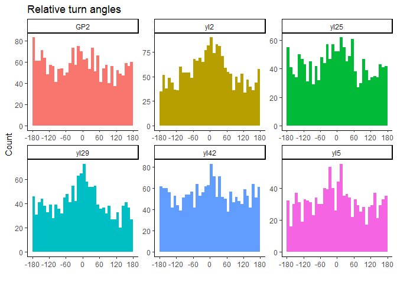<!-- -->

If you plot turn angles by individual, you might see a lot of
irregularities, especially for those animals with relatively few
locations, but if you pool turn angles across individuals, it should be
a cleaner plot with a definite hump in the middle centered around 0,
meaning the animal moves straight ahead more often than other
directions. To see what it looks like, try running all but the last two
lines of the previous code.

``` r
elk_trk_stats %>% 
  ggplot(., aes(x = turn_angle)) +  
  geom_histogram(breaks = seq(-180,180, by=10))+
  theme_classic() + 
  ylab("Count") + 
  ggtitle("Relative turn angles") + 
  scale_x_continuous("", limits = c(-180, 180), breaks = seq(-180, 180, by=60),
                     labels = seq(-180, 180, by=60))
```

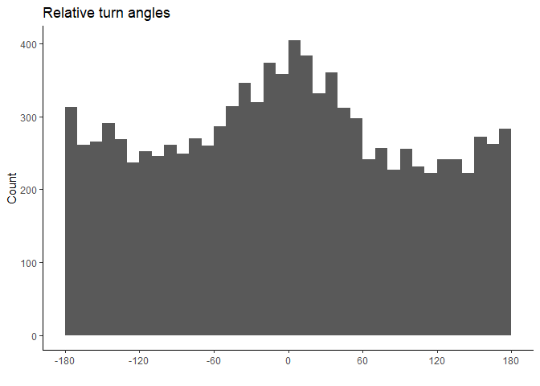<!-- --> this is a
very typical turning angle distribution showing directional persistence,
i.e., animals tend to keep going in the same direction they were headed,
0 degrees. And a lower frequency of about faces, 180 degree turns. Les
explore turning angles with polar plots.

``` r
elk_trk_stats %>% 
  ggplot(., aes(x = turn_angle, y = ..density..)) +  
  geom_histogram(breaks = seq(-180,180, by=20))+
  coord_polar(start = 0)+
  theme_classic() + 
  ylab("Count") + 
  ggtitle("Relative turn angles") + 
  scale_x_continuous("", limits = c(-180, 180), breaks = seq(-180, 180, by=60), labels = seq(-180, 180, by=60))
```

    ## Warning: The dot-dot notation (`..density..`) was deprecated in ggplot2 3.4.0.
    ## ℹ Please use `after_stat(density)` instead.

    ## Warning: Removed 12 rows containing non-finite values (`stat_bin()`).

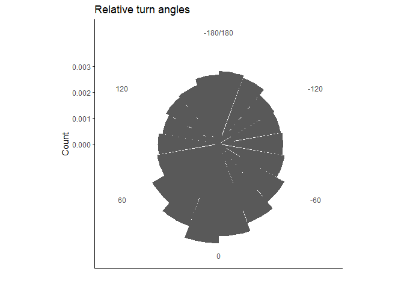<!-- -->

``` r
elk_trk_stats %>% 
  ggplot(., aes(x = turn_angle, y = ..density.., fill = id)) +  
  geom_histogram(breaks = seq(-180,180, by=20))+
  coord_polar(start = 0)+
  theme_classic() + 
  ylab("Count") + 
  ggtitle("Relative turn angles") + 
  scale_x_continuous("", limits = c(-180, 180), breaks = seq(-180, 180, by=60), labels = seq(-180, 180, by=60)) + facet_wrap( ~ id)
```

    ## Warning: Removed 12 rows containing non-finite values (`stat_bin()`).

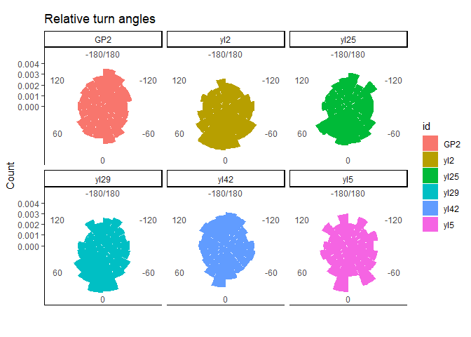<!-- -->

And we get a sense a bit of the differences in behaviour between
individual animals is slight.

Next we can plot histograms of step lengths faceted by individual.

``` r
elk_trk_stats %>% 
  ggplot(., aes(x = step_length, fill=id)) +  
  geom_histogram(breaks = seq(0,4000, by=250))+
  theme_classic() + 
  ylab("Count") + 
  ggtitle("Step lengths (m)") + 
  scale_x_continuous("", limits = c(0, 4000), breaks = seq(0, 4000, by=1000),
                     labels = seq(0, 4000, by=1000)) +
  facet_wrap(~id, scales="free") +
  theme(legend.position = "none")
```

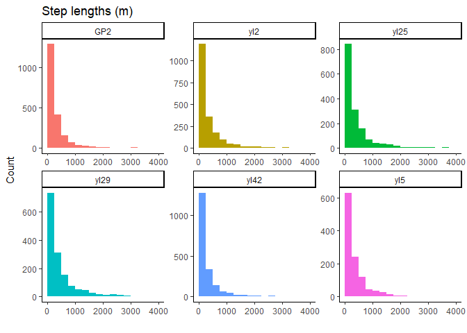<!-- -->

This is the typical distribution we see for step lengths. Usually the
animal takes shorter steps, and more rarely takes longer ones. The `amt`
package fits a *gamma* distribution, which is a very flexible
distribution, to step lengths and randomly samples from this
distribution when creating “available” steps. However, there is some
debate about whether it’s more appropriate to randomly draw from the
empirical (observed) step lengths rather than from a distributions
fitted to those step lengths. Realistically the results are probably
very similar with large enough sample sizes, but they could be very
different with small sample sizes.

Next we can plot histograms of step lengths faceted by individual.

``` r
elk_trk_stats %>% 
  ggplot(., aes(x = log(step_length), fill=id)) +  
  geom_histogram(breaks = seq(0,10, by=0.5))+
  theme_classic() + 
  ylab("Count") + 
  ggtitle("Step lengths (m)") + 
  scale_x_continuous("", limits = c(0, 10), breaks = seq(0, 10, by=1),
                     labels = seq(0, 10, by=1)) +
  facet_wrap(~id, scales="free") +
  theme(legend.position = "none")
```

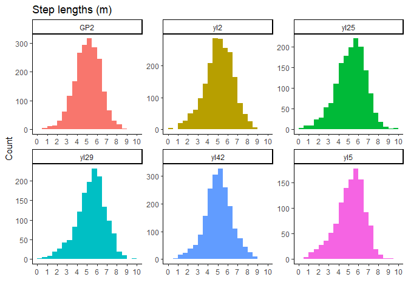<!-- -->

So, movement rate is approximately log-normal. Remember this - there is
never ever ever anything normal about movement rate parameters.

How about we see if animals move faster during the day versus at night.

``` r
ggplot(elk_trk_stats, aes(x = tod_[[4]], y = speed, fill=tod_[[4]])) + 
  geom_violin() +
  theme_bw() +
  facet_wrap(~id, scales = "free") +
  theme(legend.position = "none") +
  ylab("speed (m/s)") +
  xlab("time of day")
```

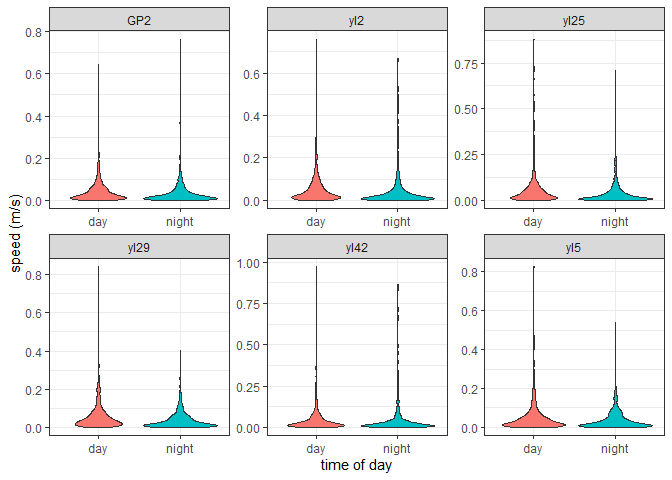<!-- -->

It’s hard to see the differences because the data are so right skewed,
so let’s take the log of speed:

``` r
ggplot(elk_trk_stats, aes(x = tod_[[4]], y = log(speed), fill=tod_[[4]])) + 
  geom_violin() +
  theme_bw() +
  facet_wrap(~id, scales = "free") +
  theme(legend.position = "none") +
  ylab("log(speed)") +
  xlab("time of day")
```

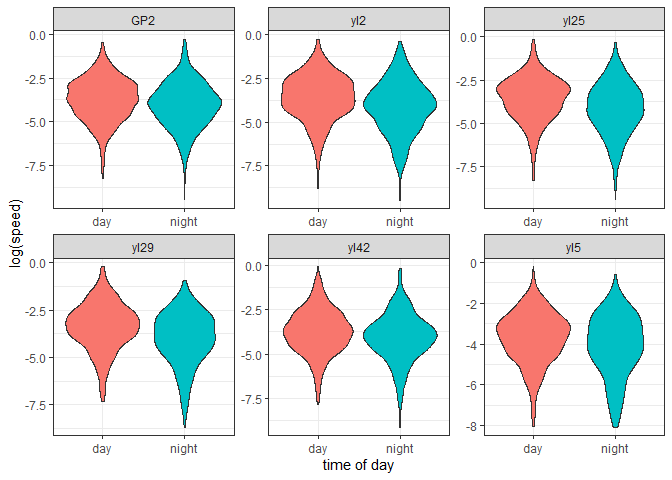<!-- --> Seems
reasonable that they move a bit faster during the day.

# Prepare SSF data frame by individual

Now we could create “available” steps by sampling from the distributions
of step lengths and turning angles in the `elk_trk` object but if we did
that, we’d be assuming that each individual had similar step length and
turn angle distributions, and we’d wash over any **individual
variation**. If we want to capture individual variation, we should
probably create **separate tracks** for each individual, which means
that we will then fit separate distributions to turn angles and step
lengths for **each individual**. To do this, we will nest the dataframe
**BEFORE** we use the amt `make_track` function. We’re merging a few
steps into a function (with argument “d”) and adding the output from
this function (our `amt` track) in a new column called “trk”.

``` r
elk_trk_id <- 
  elk_df %>% 
  nest(-id) %>% 
  mutate(trk = map(data, function(d) {
    make_track(d, lon, lat, timestamp, crs = "EPSG:4326") %>%
      transform_coords("+proj=utm +zone=11 +ellps=GRS80 +units=m +no_defs")
  }))
```

    ## Warning: All elements of `...` must be named.
    ## Did you want `data = -id`?

Now we’ve made six tracks, one for each individual.

``` r
elk_trk_id
```

    ## # A tibble: 6 × 3
    ##   id    data                 trk                   
    ##   <chr> <list>               <list>                
    ## 1 yl2   <tibble [1,999 × 4]> <trck_xyt [1,999 × 3]>
    ## 2 yl5   <tibble [1,148 × 4]> <trck_xyt [1,148 × 3]>
    ## 3 yl25  <tibble [1,558 × 4]> <trck_xyt [1,558 × 3]>
    ## 4 yl29  <tibble [1,494 × 4]> <trck_xyt [1,494 × 3]>
    ## 5 yl42  <tibble [1,970 × 4]> <trck_xyt [1,970 × 3]>
    ## 6 GP2   <tibble [2,058 × 4]> <trck_xyt [2,058 × 3]>

The “data” list-column has all our original data, and the “trk”
list-column has our data in `amt`’s `track_xyt` format. Just to remind
ourselves, let’s look at the first element (first animal) in the “trk”
list-column.

``` r
elk_trk_id$trk[[1]]
```

    ## # A tibble: 1,999 × 3
    ##         x_       y_ t_                 
    ##  *   <dbl>    <dbl> <dttm>             
    ##  1 603229. 5732236. 2003-04-15 00:00:00
    ##  2 603155. 5732326. 2003-04-15 02:00:00
    ##  3 602917. 5732472. 2003-04-15 04:00:00
    ##  4 602729. 5732580. 2003-04-15 06:00:00
    ##  5 602489. 5732709. 2003-04-15 08:00:00
    ##  6 602473. 5732727. 2003-04-15 10:00:00
    ##  7 602412. 5732731. 2003-04-15 12:00:00
    ##  8 602158. 5732509. 2003-04-15 18:00:00
    ##  9 601884. 5732442. 2003-04-15 20:00:00
    ## 10 601574. 5732337. 2003-04-15 22:00:00
    ## # … with 1,989 more rows

## Create available steps and extract covariates

Alright, there’s a lot going on in this next chunk of code, so we’ll go
throughout it piece by piece. Within the mutate call, we use
`purrr::map` to apply a number of `amt` functions to the “trk” list
column we created above.

Learn more about `steps_by_burst`

`step_lengths can be use to calculate step lengths of a track. direction_abs and direction_rel calculate the absolute and relative direction of steps. steps converts a track_xy* from a point representation to a step representation and automatically calculates step lengths and relative turning angles.`

In order, the functions are:

1)  Resampling (or regularizing) our track so we have regular intervals
    between consecutive locations (in this case every two hours, with a
    20 minute tolerance). When there is a interval between successive
    locations that is more or less than that 2 hour period, locations
    before and after that time gap will be placed into different
    **bursts**. Step lengths and turning angles will not be calculated
    across bursts, only within them.

Learn more about this step here: `?track_resample`

2)  Only retain bursts with at least 3 locations, because we need a
    minimum of three locations to calculate relative turn angles.

learn more here: `?filter_min_n_burst`

3)  Creates steps (only within a burst!) between used locations. This
    automatically calculates step lengths and turn angles.

`?steps_by_burst`

4)  Creates 3 random “available” steps per used step. You could choose
    more but 3 is good for now. `random_steps`

5)  Extracts the covariate values (for all layers in the raster stack)
    at the endpoint of each step. You could extract values at the
    beginning point of each step too. It shouldn’t make much difference
    (but you could try it and see!) `extract_covariates`. For this
    function we have to change the object `habitat_stack` from a
    SpatRaster (created by terra) to a Raster object using package
    \`raster\`\`

``` r
habitat_stack_layer <- as(habitat_stack, "Raster")

ssf_2_hr <- elk_trk_id %>%
  mutate(steps_2_hr = purrr::map(trk, function(x) {
    x %>%
      track_resample(rate = minutes(120), tolerance = minutes(20)) %>%
      filter_min_n_burst(min_n = 3) %>%
      steps_by_burst(diff_time_units = "hours") %>%
      random_steps(n = 3) %>% 
      extract_covariates(habitat_stack_layer, where = "end")
  })) %>%
  dplyr::select(id, steps_2_hr) %>%
  unnest() 
head(ssf_2_hr)
```

    ## # A tibble: 6 × 17
    ##   id    burst_     x1_     x2_      y1_     y2_   sl_    ta_ t1_                
    ##   <chr>  <dbl>   <dbl>   <dbl>    <dbl>   <dbl> <dbl>  <dbl> <dttm>             
    ## 1 yl2        1 603229. 603155. 5732236.  5.73e6 117.  NA     2003-04-15 00:00:00
    ## 2 yl2        1 603229. 602947. 5732236.  5.73e6 716.   2.05  2003-04-15 00:00:00
    ## 3 yl2        1 603229. 603023. 5732236.  5.73e6 670.  -0.379 2003-04-15 00:00:00
    ## 4 yl2        1 603229. 603019. 5732236.  5.73e6 390.   1.88  2003-04-15 00:00:00
    ## 5 yl2        1 603155. 602917. 5732326.  5.73e6 279.   0.328 2003-04-15 02:00:00
    ## 6 yl2        1 603155. 603248. 5732326.  5.73e6  97.7 -2.31  2003-04-15 02:00:00
    ## # … with 8 more variables: t2_ <dttm>, dt_ <drtn>, step_id_ <int>, case_ <lgl>,
    ## #   elev <dbl>, slope <dbl>, d_human <dbl>, d_high_human <dbl>

So, we are doing a *point-based* SSF rather than a *path-based* SSF.
[Daniel Fortin et al.’s SSF paper from
2005](https://esajournals.onlinelibrary.wiley.com/doi/full/10.1890/04-0953)
is an example of a path-based SSF.

Take a look at what we just created above with that monster chunk of
code.

``` r
print(ssf_2_hr, width=Inf)
```

    ## # A tibble: 37,380 × 17
    ##    id    burst_     x1_     x2_      y1_      y2_    sl_     ta_
    ##    <chr>  <dbl>   <dbl>   <dbl>    <dbl>    <dbl>  <dbl>   <dbl>
    ##  1 yl2        1 603229. 603155. 5732236. 5732326. 117.   NA     
    ##  2 yl2        1 603229. 602947. 5732236. 5731577. 716.    2.05  
    ##  3 yl2        1 603229. 603023. 5732236. 5732873. 670.   -0.379 
    ##  4 yl2        1 603229. 603019. 5732236. 5731907. 390.    1.88  
    ##  5 yl2        1 603155. 602917. 5732326. 5732472. 279.    0.328 
    ##  6 yl2        1 603155. 603248. 5732326. 5732353.  97.7  -2.31  
    ##  7 yl2        1 603155. 603157. 5732326. 5732323.   3.39  2.77  
    ##  8 yl2        1 603155. 603226. 5732326. 5732473. 163.   -1.47  
    ##  9 yl2        1 602917. 602729. 5732472. 5732580. 217.    0.0306
    ## 10 yl2        1 602917. 602917. 5732472. 5732467.   5.31  2.05  
    ##    t1_                 t2_                 dt_     step_id_ case_  elev slope
    ##    <dttm>              <dttm>              <drtn>     <int> <lgl> <dbl> <dbl>
    ##  1 2003-04-15 00:00:00 2003-04-15 02:00:00 2 hours        1 TRUE  1688. 12.8 
    ##  2 2003-04-15 00:00:00 2003-04-15 02:00:00 2 hours        1 FALSE 1561.  3.26
    ##  3 2003-04-15 00:00:00 2003-04-15 02:00:00 2 hours        1 FALSE 1717.  5.87
    ##  4 2003-04-15 00:00:00 2003-04-15 02:00:00 2 hours        1 FALSE 1614. 14.2 
    ##  5 2003-04-15 02:00:00 2003-04-15 04:00:00 2 hours        2 TRUE  1694.  5.66
    ##  6 2003-04-15 02:00:00 2003-04-15 04:00:00 2 hours        2 FALSE 1688. 12.8 
    ##  7 2003-04-15 02:00:00 2003-04-15 04:00:00 2 hours        2 FALSE 1688. 12.8 
    ##  8 2003-04-15 02:00:00 2003-04-15 04:00:00 2 hours        2 FALSE 1719.  5.55
    ##  9 2003-04-15 04:00:00 2003-04-15 06:00:00 2 hours        3 TRUE  1694.  5.66
    ## 10 2003-04-15 04:00:00 2003-04-15 06:00:00 2 hours        3 FALSE 1694.  5.66
    ##    d_human d_high_human
    ##      <dbl>        <dbl>
    ##  1    60.5       0.0129
    ##  2    79.3     115.    
    ##  3    82.2       3.85  
    ##  4    64.6       1.32  
    ##  5   101.       13.9   
    ##  6    60.5       0.0129
    ##  7    60.5       0.0129
    ##  8    78.0       0.606 
    ##  9   101.       13.9   
    ## 10   101.       13.9   
    ## # … with 37,370 more rows

There seems to be a lot of zeros in the “d_high_human” column, which
makes me think something might not be right with that layer, so I’m just
not going to include it in our simple model below.

Visualizing the SSF sampling for a zoomed in portion of our study area:

``` r
ggplot(ssf_2_hr, aes(x=x2_, y= y2_, colour = case_)) + geom_point() + geom_path()+ xlim(550000, 560000) + ylim(5700000, 5710000)
```

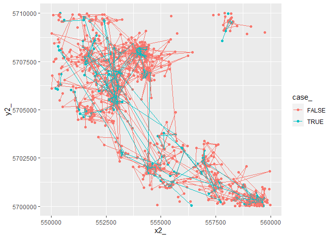<!-- -->

Ignore the connected FALSE (random) points, but the blue paths between
GPS locations gives you a sense of the path, and, the random points the
sampling distribution. Compare this conceptually to a home-range based
3rd order scale sampling regime for availability. What would differ? How
would the range of availability differ between a 3rd order with a MCP,
Kernel, and then this step selection scale of sampling??

## Univariate Plotting of Used versus Available Points

Now that we have available steps, we can do a quick plot of slope for
“used” versus available “points”

``` r
ggplot(ssf_2_hr, aes(x = case_, y = slope, fill=case_)) + 
  geom_violin() +
  theme_bw() +
  theme(legend.position = "none") +
  ylab("slope (m)") +
  xlab("")
```

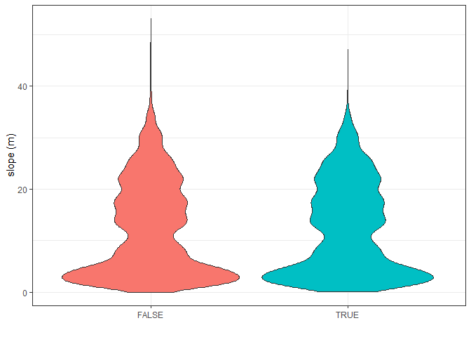<!-- --> Looks like
they might barely be selecting lower slopes, which is probably what we’d
expect…Lets continue our graphical exploration of the other covariates

``` r
ggplot(ssf_2_hr, aes(x = case_, y = elev, fill=case_)) + 
  geom_violin() +
  theme_bw() +
  theme(legend.position = "none") +
  ylab("slope (m)") +
  xlab("")
```

<!-- -->

Similarly, slight selection probably for lower elevations.

``` r
ggplot(ssf_2_hr, aes(x = case_, y = d_human, fill=case_)) + 
  geom_violin() +
  theme_bw() +
  theme(legend.position = "none") +
  ylab("slope (m)") +
  xlab("")
```

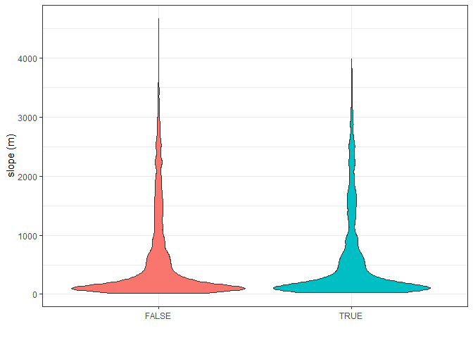<!-- -->

Looks like they might barely be selecting lower slopes, which is
probably what we’d expect…

# Running an SSF model in `amt`

Before running our model, we need to create a “stratum” field, which is
a unique identifier for each set of “used” and “available” points. This
is because conditional logistic regression estimates relative
probability of use conditioned on resources available at a given time
step. To create this “stratum” field we’ll just combine the animal “id”
field” with the “step_id\_” field.

``` r
ssf_2_hr$stratum <- paste(ssf_2_hr$id, ssf_2_hr$burst_, ssf_2_hr$step_id_)
head(ssf_2_hr$stratum)
```

    ## [1] "yl2 1 1" "yl2 1 1" "yl2 1 1" "yl2 1 1" "yl2 1 2" "yl2 1 2"

So what this does is make each elk GPS location, and, its ‘random
samples’ a stratum.

We can simplify our dataframe and name it our “raw” dataframe because
has unscaled covariate values. We might fit a model using this dataframe
if we were making a predictive map of selection (which is definitely a
challenge in an SSF framework)!

``` r
ssf_2_hr_raw <-
  ssf_2_hr %>%
  dplyr::select(id, case_, t2_, elev, slope, d_human, d_high_human, step_id_, stratum)
```

Then we can scale and center our variables so it’s easier to interpret
selection coefficients across continuous covariates with different units
(in our simple analysis, they’re all in meters, but that’s not always
the case).

``` r
ssf_2_hr_scaled <-
  ssf_2_hr_raw %>%
  mutate(
    elev = as.numeric(scale(elev)),
    slope = as.numeric(scale(slope)),
    d_human = as.numeric(scale(d_human)),
    d_high_human = as.numeric(scale(d_high_human))
  )
```

## Fitting SSFs with clogit in R

Next, we will fit a ‘naive’ clogit model, that is, a model that does not
account for any differences between individuals and treats all
step_id\_’s as independent.Basically ignoring any random effects
structure of individual fishers in this case. In Lab 10, next week, we
will build complexity into SSF models with mixed-effects. But it takes a
bit of learning to understand how R uses survival models to fit a
conditional logistic regression model. Here, I borrow from: \_from
<https://rdrr.io/cran/survival/man/clogit.html_>

It turns out that the loglikelihood for a conditional logistic
regression model = loglik from a Cox proportional hazards model with a
particular data structure. Proving this is a nice homework exercise for
a PhD statistics class; not too hard, but the fact that it is true is
surprising.

When a well tested Cox PH model routine is available many packages use
this ‘trick’ rather than writing a new software routine for the
conditional likelihood of a clogit model from scratch, and this is what
the clogit routine does. In detail, we use a stratified Cox model with
each case/control group assigned to its own stratum, *time set to a
constant*, status of 1=case 0=control, and using the exact partial
likelihood has the same likelihood formula as a conditional logistic
regression. The clogit routine creates the necessary dummy variable of
times (all 1) and the strata, then calls coxph.

Learn more about clogit `?clogit`

Here’s a simple model with three covariates (no distance to high human
access). You’ll see the “strata” argument in here, where we tell
`clogit` what field has the unique id for matched sets of used and
available points.

We are using the “cluster” argument in `survival::clogit` to cluster
locations by individual id. Mark may talk about this more, but basically
this is a very conservative way to account for non-independence of
observations within an individual. It calculates robust standard errors
for coefficient estimates. These robust standard errors are larger than
the normal standard errors. A more rigorous analysis would be to do a
mixed effects SSF and have a random effect for individual, but that’s
for Mark to teach!

``` r
ssf_model <- 
  clogit(case_ ~ elev + slope + d_human +  
           strata(stratum) + cluster(id), method = "approximate", data = ssf_2_hr_scaled)
summary(ssf_model)
```

    ## Call:
    ## coxph(formula = Surv(rep(1, 37380L), case_) ~ elev + slope + 
    ##     d_human + strata(stratum), data = ssf_2_hr_scaled, method = "breslow", 
    ##     cluster = id)
    ## 
    ##   n= 37380, number of events= 9345 
    ## 
    ##             coef exp(coef) se(coef) robust se      z Pr(>|z|)
    ## elev     0.03989   1.04070  0.06678   0.15851  0.252    0.801
    ## slope   -0.03422   0.96635  0.03125   0.10345 -0.331    0.741
    ## d_human -0.16185   0.85057  0.05090   0.13595 -1.191    0.234
    ## 
    ##         exp(coef) exp(-coef) lower .95 upper .95
    ## elev       1.0407     0.9609    0.7628     1.420
    ## slope      0.9664     1.0348    0.7890     1.184
    ## d_human    0.8506     1.1757    0.6516     1.110
    ## 
    ## Concordance= 0.505  (se = 0.013 )
    ## Likelihood ratio test= 14.05  on 3 df,   p=0.003
    ## Wald test            = 75.24  on 3 df,   p=3e-16
    ## Score (logrank) test = 13.99  on 3 df,   p=0.003,   Robust = 5.62  p=0.1
    ## 
    ##   (Note: the likelihood ratio and score tests assume independence of
    ##      observations within a cluster, the Wald and robust score tests do not).

You can see the robust standard errors in the summary output.

And finally, a very quick and dirty plot of the coefficients using the
`sjPlot` package. Note that by default, `plot_model` is plotting the
exponentiated coefficients, so 1 is the cutoff between selection and
avoidance, rather than 0. We will plot the raw coefficients by
specifying no transformation:

``` r
plot_model(ssf_model, title="SSF Coefficients", transform = NULL)
```

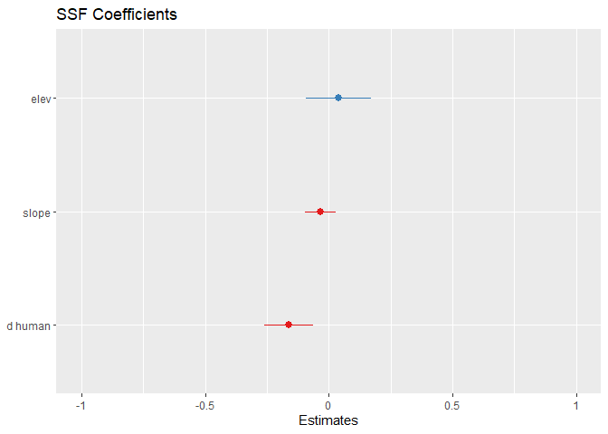<!-- -->

Obviously, this isn’t an exciting model, but you could infer that elk
are selecting areas closer to humans (negative coefficent for distance)
and lower slopes, but the elevation results are pretty equivocal. You
could try adding quadratic terms and interactions to represent different
hypotheses, but you’d probably want to add some better covariates to
make any stronger inference about elk resource selection with these
data.

## Comparing to a Naive Logistic Regression

Note that we can analyze the same dataset, ignoring the conditioning of
space in the movement path of the animal by ignoring stratum and fitting
a glm.

Lets compare the model coefficients from the ssf_model and rsf_model. We
will just fit a simple glmm model with a random intercept for individual
elk id, and not bother too much for now with glmmTMB, random
coefficients, etc.

``` r
glmm_model = glmer(case_ ~ elev + slope + d_human + (1|id), data=ssf_2_hr_scaled, family=binomial(link="logit"))
summary(glmm_model)
```

    ## Generalized linear mixed model fit by maximum likelihood (Laplace
    ##   Approximation) [glmerMod]
    ##  Family: binomial  ( logit )
    ## Formula: case_ ~ elev + slope + d_human + (1 | id)
    ##    Data: ssf_2_hr_scaled
    ## 
    ##      AIC      BIC   logLik deviance df.resid 
    ##  42048.2  42090.9 -21019.1  42038.2    37375 
    ## 
    ## Scaled residuals: 
    ##      Min       1Q   Median       3Q      Max 
    ## -0.59526 -0.57969 -0.57624  0.00603  1.79367 
    ## 
    ## Random effects:
    ##  Groups Name        Variance  Std.Dev. 
    ##  id     (Intercept) 5.223e-14 2.285e-07
    ## Number of obs: 37380, groups:  id, 6
    ## 
    ## Fixed effects:
    ##             Estimate Std. Error z value Pr(>|z|)    
    ## (Intercept) -1.09868    0.01195 -91.974   <2e-16 ***
    ## elev         0.02199    0.02351   0.936    0.349    
    ## slope       -0.01681    0.01877  -0.896    0.370    
    ## d_human     -0.01930    0.01741  -1.108    0.268    
    ## ---
    ## Signif. codes:  0 '***' 0.001 '**' 0.01 '*' 0.05 '.' 0.1 ' ' 1
    ## 
    ## Correlation of Fixed Effects:
    ##         (Intr) elev   slope 
    ## elev    -0.006              
    ## slope    0.005 -0.683       
    ## d_human  0.007 -0.613  0.138
    ## optimizer (Nelder_Mead) convergence code: 0 (OK)
    ## boundary (singular) fit: see help('isSingular')

``` r
plot_model(ssf_model, transform = NULL)
```

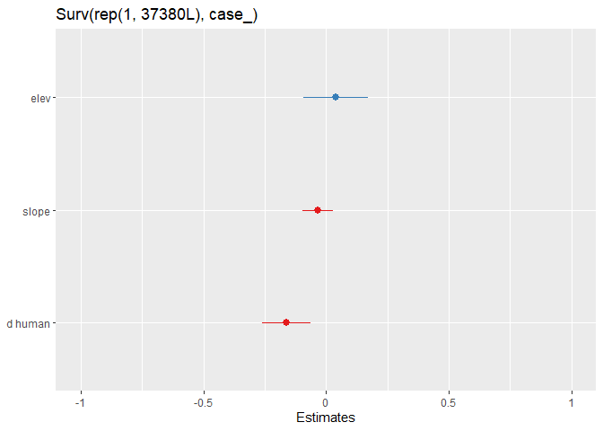<!-- -->

``` r
plot_model(glmm_model, transform = NULL)
```

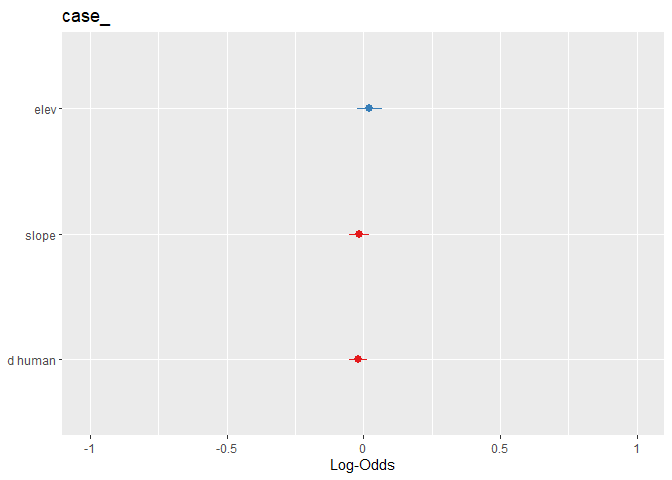<!-- -->

``` r
coef(ssf_model)
```

    ##        elev       slope     d_human 
    ##  0.03989051 -0.03422421 -0.16185332

``` r
fixef(glmm_model)
```

    ## (Intercept)        elev       slope     d_human 
    ## -1.09868199  0.02199404 -0.01681315 -0.01929826

How do we interpret the differences between these models? In the SSF
model, the coefficient for elevation was + 0.1058, but in the RSF model,
the coefficient was +0.05. So the sign was the same, but, half the
magnitude. To understand the differences between models, remind
yourselves of the assumption of the RSF vs SSF models. RSF models assume
independence amongst all locations, so that its more of a theoretical
preference/selectivity calculation ASSUMING the animal can choose
amongst all available locations. In the clogit, we have constrained the
likelihood to be conditioned on each step (stratum). That the
coefficient is double in strength means that they show stronger
selection for elevation along the path scale than the entire seasonal
home range scale.

Similarly, the coefficient for Slope is stronger at the SSF scale, and
likewise for being close to human activity. The differences between
‘scales’ here is not ‘wrong’, but simply reflects the scale dependence
of the SSF process at 2 hours compared to the entire seasonal summer
range of these individual elk. Learning to understand and compare
inferences about selection by comparing estimates from conditioned and
unconditioned sampling of availability will help you understand what SSF
models do in your own studies.

## Interpreting Clogit Models

We can make the same sorts of interpretations of the coefficients from
clogit models as the exponential model of an RSF. First, we can estimate
the log-odds by exponentiating:

``` r
exp(coef(ssf_model))
```

    ##      elev     slope   d_human 
    ## 1.0406968 0.9663548 0.8505660

This tells us that for every increase in elevation by 1 standard
deviation, the odds of elk use increase by 1.11. Etc.

## Predicting

We can use standard post-estimtion commands like predict, type =
“expected” to get the predicted relative probability of selection by elk
as a function of the covariates. I’ll then plot it to start exploring
whether we think there are any differences, really, amongst elk here to
explore thinking ahead to next week when we add random effects.

``` r
ssf_2_hr_scaled$predSSF <- predict(ssf_model, type = "expected")
hist(ssf_2_hr_scaled$predSSF)
```

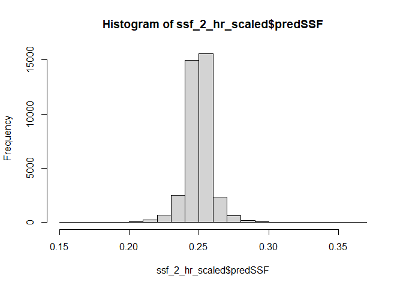<!-- -->

``` r
plot(ssf_2_hr_scaled$elev, ssf_2_hr_scaled$predSSF)
```

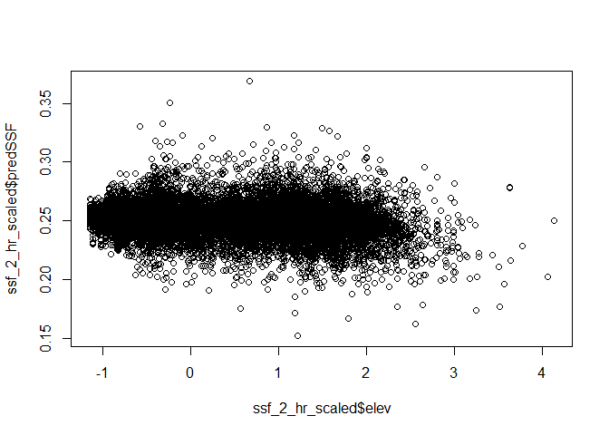<!-- -->

``` r
ggplot(ssf_2_hr_scaled, aes(x=elev, y = predSSF, colour = id)) + stat_smooth(method="glm", method.args = list(family="binomial"))
```

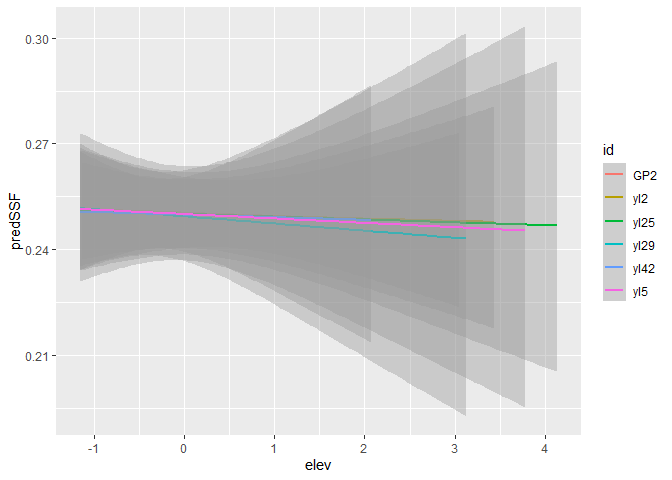<!-- -->

Note the Y axis here is the relative predicted probabilitiy of selection
We can explore for the other covariates, slope and d_human

``` r
ggplot(ssf_2_hr_scaled, aes(x=slope, y = predSSF, colour = id)) + stat_smooth(method="glm", method.args = list(family="binomial"))
```

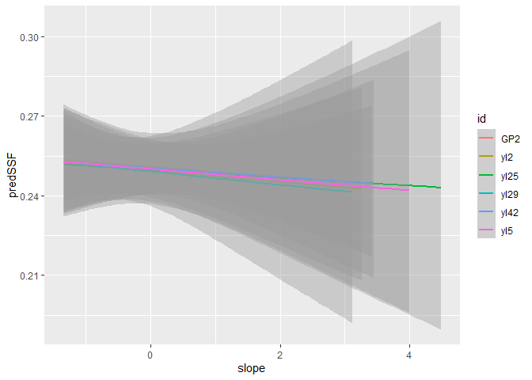<!-- -->

``` r
ggplot(ssf_2_hr_scaled, aes(x=d_human, y = predSSF, colour = id)) + stat_smooth(method="glm", method.args = list(family="binomial"))
```

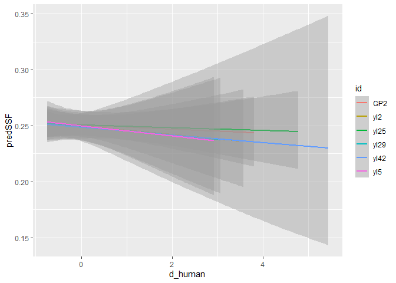<!-- -->

## Model selection in SSF models

We can also do SSF models easily on different clogit models.

``` r
ssf_model1 <- clogit(case_ ~ elev + strata(stratum) + cluster(id), method = "approximate", data = ssf_2_hr_scaled)

ssf_model2 <- clogit(case_ ~ elev + slope + strata(stratum) + cluster(id), method = "approximate", data = ssf_2_hr_scaled)

ssf_model3 <- clogit(case_ ~ elev + d_human + strata(stratum) + cluster(id), method = "approximate", data = ssf_2_hr_scaled)

ssf_model4 <- clogit(case_ ~ d_human + strata(stratum) + cluster(id), method = "approximate", data = ssf_2_hr_scaled)

AIC(ssf_model, ssf_model1, ssf_model2, ssf_model3, ssf_model4)
```

    ##            df      AIC
    ## ssf_model   3 25901.79
    ## ssf_model1  1 25909.01
    ## ssf_model2  2 25909.94
    ## ssf_model3  2 25900.99
    ## ssf_model4  1 25899.00

However, we cannot use AIC to compare clogit models to glm models for
the same data, but without conditioning.

``` r
AIC(glmm_model, ssf_model)
```

    ## Warning in AIC.default(glmm_model, ssf_model): models are not all fitted to the
    ## same number of observations

    ##            df      AIC
    ## glmm_model  5 42048.23
    ## ssf_model   3 25901.79

# Literature

Compton, B. W., J. M. Rhymer, and M. McCollough. 2002. Habitat selection
by wood turtles (Clemmys insculpta): An application of paired logistic
regression. Ecology 83:833-843.

Forester, J. D., H. K. Im, and P. J. Rathouz. 2009. Accounting for
animal movement in estimation of resource selection functions: sampling
and data analysis. Ecology 90:3554-3565.

Skellam, J. G. 1951. Random dispersal in theoretical populations.
Biometrika 38:196-218.

Thurfjell, H., S. Ciuti, and M. S. Boyce. 2014. Applications of
step-selection functions in ecology and conservation. Movement Ecology
2:4.

Turchin, P. 1998. Quantitative analysis of movement: measuring and
modeling population redistribution in animals and plants. Sinauer
Associates, Inc., Sunderland, Massachusetts.

Whittington, J., C. C. St Clair, and G. Mercer. 2005. Spatial Responses
of Wolves to Roads and Trails in Mountain Valleys. Ecological
Applications 15:543-553.
